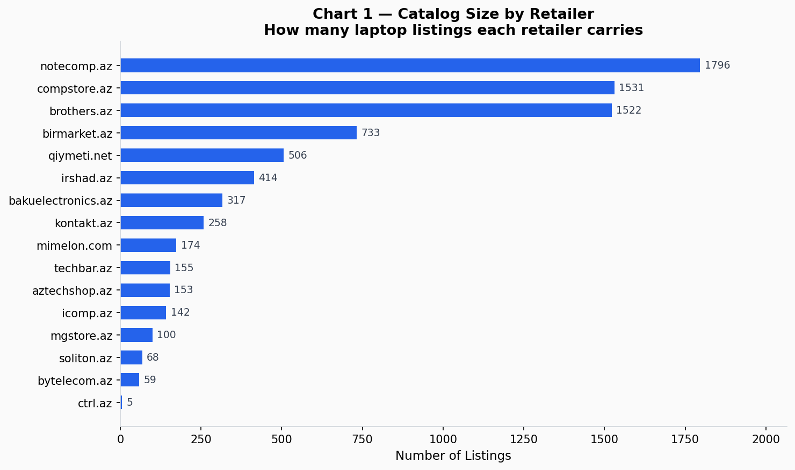
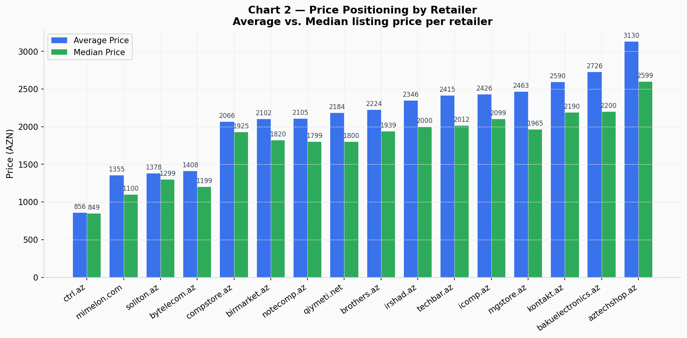
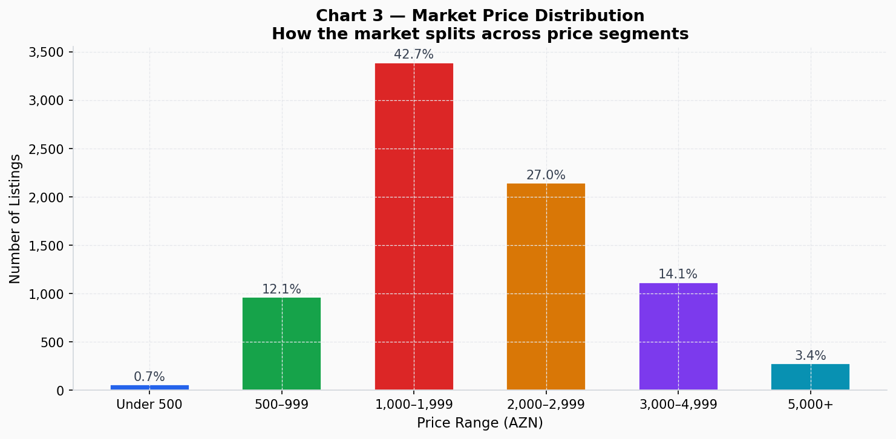
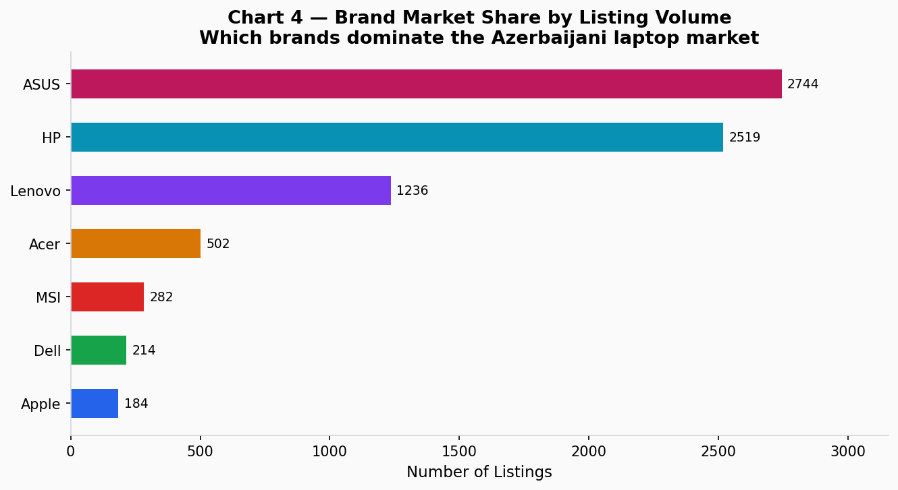
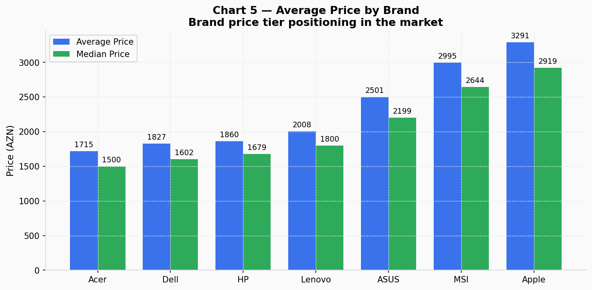
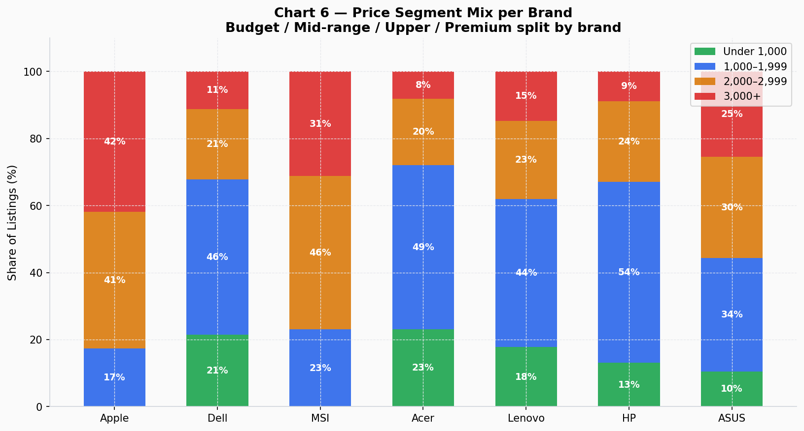
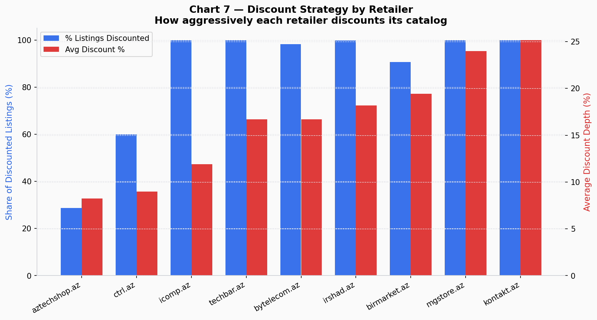
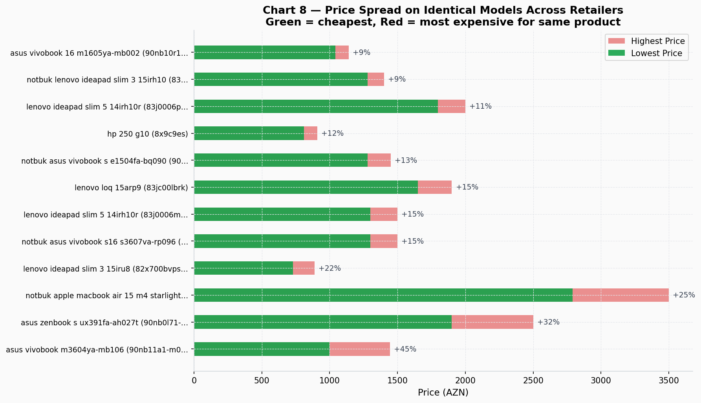
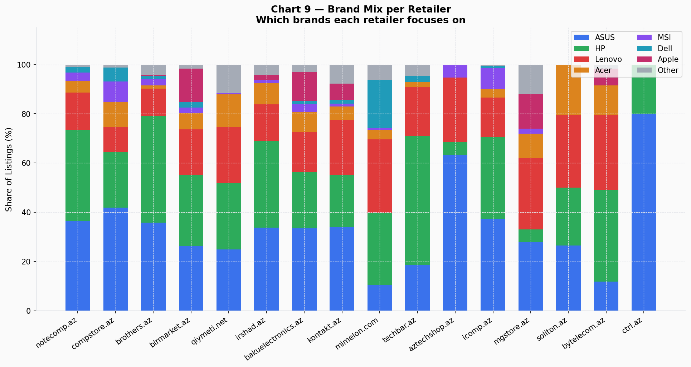
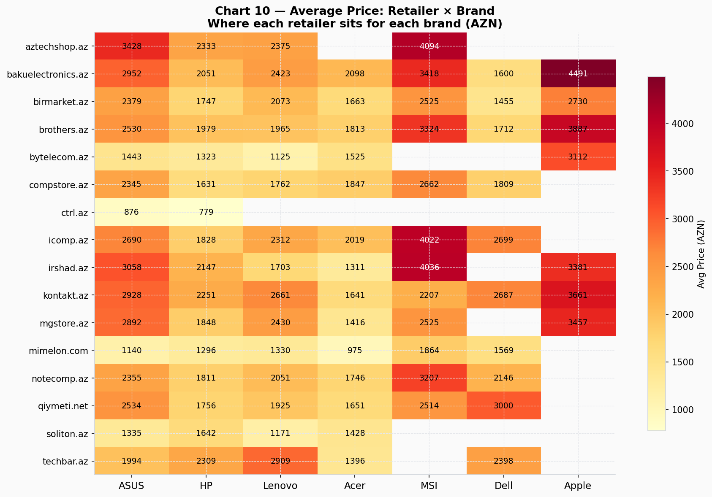

# Azerbaijan Laptop Market — Business Intelligence Report

- **Data scope:** 8,548 laptop listings scraped from 16 e-commerce retailers operating in Azerbaijan.
- **Analysis date:** February 2026

---

## Executive Summary

The Azerbaijani laptop retail market is large, fragmented, and uneven. A small number of retailers dominate the catalog, the mid-range price segment (1,000–2,000 AZN) accounts for nearly half of all listings, ASUS and HP together hold more than 60% of market presence, and pricing for the same product can vary by up to 45% depending on where a customer shops. Retailers that actively discount run average markdowns of 16–25%, while several major players publish only final prices with no visible discount signaling at all.

---

## 1. Catalog Size — Who Controls the Shelf Space

**What it shows:** The number of laptop listings each retailer carries.

**Key findings:**
- **notecomp.az** and **compstore.az** each carry over 1,500 listings, making them the dominant catalog players — roughly 4× larger than any mid-tier competitor.
- **brothers.az** (1,522 listings) is the third-largest by volume, despite being a less prominent brand.
- The bottom six retailers together account for fewer than 600 listings combined.

**Business implication:** Retailers with large catalogs capture more search traffic and price-comparison clicks. Smaller retailers risk invisibility unless they differentiate on price, service, or niche. Any new entrant competing on breadth alone faces a steep disadvantage against the top three.

---

## 2. Price Positioning — Where Each Retailer Competes

**What it shows:** Average and median listing price for each retailer, sorted from lowest to highest average.

**Key findings:**
- **aztechshop.az** has the highest average price (3,130 AZN) — it is clearly positioned as a premium-oriented outlet.
- **bakuelectronics.az** and **kontakt.az** follow with averages above 2,500 AZN, targeting upper-mid and premium buyers.
- **ctrl.az**, **bytelecom.az**, and **mimelon.com** have the lowest averages (under 1,500 AZN), suggesting a budget or clearance focus.
- The gap between average and median is widest for aztechshop.az and bakuelectronics.az, indicating that a small number of very high-ticket items pull their averages up.

**Business implication:** Retailers are not competing on a level playing field — they occupy distinct price tiers. A retailer targeting the 1,000–2,000 AZN segment (Chart 3 shows this is the largest) should benchmark against notecomp.az, birmarket.az, and compstore.az rather than aztechshop.az or kontakt.az.

---

## 3. Market Price Distribution — Where Demand Lives

**What it shows:** How all 7,933 priced listings distribute across six price brackets.

**Key findings:**
- The **1,000–1,999 AZN** band is by far the largest, containing **42.7%** of all listings (3,386 units).
- **2,000–2,999 AZN** is the second-largest segment at 27.0%.
- Together, the 1,000–2,999 AZN range covers nearly **70% of the entire market**.
- Budget laptops under 500 AZN represent less than 1% — the low-cost entry segment is essentially absent.
- The premium segment above 5,000 AZN is a niche at 3.4%.

**Business implication:** The sweet spot for volume is the 1,000–2,000 AZN range. Any retailer under-represented in this bracket is missing the bulk of market activity. Conversely, the 3,000–5,000 AZN upper-mid segment (14.1%) is large enough to be meaningful and may face less direct price competition.

---

## 4. Brand Market Share — The Duopoly

**What it shows:** Total listings for each major brand across all retailers.

**Key findings:**
- **ASUS** (2,744 listings) and **HP** (2,470 listings) together represent **65% of all identifiable-brand listings**.
- **Lenovo** is a distant third at 1,285 listings (16%).
- **Acer** and **MSI** are mid-tier at 502 and 282 respectively.
- **Dell** and **Apple** trail significantly, with Dell at 214 and Apple at just 184.

**Business implication:** Any retailer without strong ASUS and HP coverage is missing the majority of customer searches. Apple's low presence (184 listings) despite its global brand strength is a notable gap — suggesting either low supply, high price sensitivity, or a niche that is underserved and potentially lucrative.

---

## 5. Brand Price Positioning — Premium vs. Volume

**What it shows:** Average and median listing price by brand.

**Key findings:**
- **Apple** commands the highest average price at 3,291 AZN — nearly double HP's average of 1,847 AZN.
- **MSI** is the second-most expensive brand at 2,995 AZN average, reflecting its gaming-laptop focus.
- **HP** and **Acer** are the two most affordable major brands, with medians of 1,661 AZN and 1,500 AZN respectively — making them the volume workhorses.
- **ASUS** sits in the middle at 2,501 AZN average, serving both budget (VivoBook) and premium (ROG/Zenbook) segments.

**Business implication:** HP and Acer win on volume; Apple and MSI win on margin per unit. A healthy retailer portfolio carries both. Retailers heavy in HP/Acer may face tighter margins; those strong in Apple/MSI have margin potential but lower turnover.

---

## 6. Price Segment Mix per Brand — Where Each Brand Plays

**What it shows:** For each brand, the share of listings in budget (<1,000), mid (1,000–1,999), upper-mid (2,000–2,999), and premium (3,000+) price bands.

**Key findings:**
- **MSI** and **Apple** are overwhelmingly premium-focused: over 60% of their listings are priced above 3,000 AZN.
- **HP** and **Acer** are the most budget-accessible brands: roughly 13% of HP listings are under 1,000 AZN, and over 50% are in the 1,000–1,999 band.
- **ASUS** is the most evenly distributed brand — it competes in every segment simultaneously, from budget VivoBooks to premium ROG gaming machines.
- **Lenovo** is concentrated in the mid range, with a relatively small ultra-premium presence.

**Business implication:** ASUS and Lenovo are the safest brands for a "full-market" strategy. MSI and Apple require premium-market positioning to sell well. If a retailer wants to attract first-time buyers, HP and Acer are the entry points. If the goal is to increase basket value, expanding Apple and MSI inventory is the lever.

---

## 7. Discount Strategy — Who Competes on Price

**What it shows:** For retailers that publish discount data — what percentage of their listings are discounted, and how deep those discounts run on average.

**Key findings:**
- **kontakt.az** and **mgstore.az** have the most aggressive discounting: 100% of listings show a crossed-out original price, with average discounts of 25.2% and 24.0% respectively.
- **irshad.az** discounts 99.8% of its catalog at an average 18.2%, making deep discounting its core pricing message.
- **birmarket.az** discounts 91% of listings at an average 19.4%.
- **icomp.az** discounts its entire catalog but at a shallower 11.9%.
- Six major retailers — notecomp.az, compstore.az, brothers.az, qiymeti.net, soliton.az, and bakuelectronics.az — publish **no discount information at all**, relying instead on straightforward final pricing.

**Business implication:** Heavy discounting (kontakt, mgstore, irshad, birmarket) is a well-established competitive tactic in this market. However, it creates an expectation of perpetual sale. Retailers without visible discounts may be at a psychological disadvantage when customers comparison-shop, even if their final prices are competitive. The six non-discounting retailers should evaluate whether adding visible "was/now" pricing would improve conversion.

---

## 8. Price Spread on Identical Products — The Arbitrage Gap

**What it shows:** For products listed on three or more retailers, the range between the cheapest and most expensive price found.

**Key findings:**
- The same **ASUS VivoBook M3604YA** is sold for 999 AZN on one retailer and 1,444 AZN on another — a **44.5% price gap** for the identical model.
- **Apple MacBook Air 15 M4** shows a 25.4% gap (2,791 vs. 3,500 AZN) across three retailers.
- Even "commodity" models like **HP 250 G10** show a 12% spread (810 vs. 909 AZN) across four retailers.
- Across the 24 models that appear on 3+ retailers, every single one has a price gap of at least 6%.

**Business implication:** Customers who price-compare can consistently find the same product significantly cheaper. This means retailers charging above-market prices on identifiable models risk losing informed buyers entirely. Price monitoring of shared SKUs — particularly popular ASUS VivoBook and Lenovo IdeaPad models — should be an ongoing competitive intelligence activity.

---

## 9. Brand Mix per Retailer — Differentiation and Coverage

**What it shows:** For each retailer, the proportion of listings from each major brand.

**Key findings:**
- Most large retailers show a broadly similar ASUS/HP-dominant mix, reflecting the overall market structure.
- **aztechshop.az** stands out: it carries zero HP products, focusing almost entirely on ASUS — a deliberate or structural specialization.
- **techbar.az** skews heavily toward HP relative to ASUS compared to peers.
- **mimelon.com** has a notably high Lenovo share, suggesting a mid-market, business-laptop focus.
- **soliton.az** has the most even distribution across ASUS, HP, Lenovo, and Acer.

**Business implication:** Retailers that are over-concentrated in one brand carry execution risk if that brand has supply issues, price increases, or reputation problems. Diversified retailers are more resilient. aztechshop.az's zero-HP strategy is notable — either a strategic choice or a supplier gap that should be intentionally addressed.

---

## 10. Average Price by Retailer and Brand — The Pricing Matrix

**What it shows:** The average price for each brand at each retailer. Darker red = higher price, lighter yellow = lower price. Empty cells mean the retailer does not carry that brand.

**Key findings:**
- **Apple pricing** varies most dramatically across retailers — gaps of 500–800 AZN for the same brand depending on retailer.
- **aztechshop.az** consistently prices ASUS products higher than all other retailers for the same brand.
- **soliton.az** and **bytelecom.az** tend to show lower average prices across all brands they carry.
- For **HP**, pricing is relatively consistent across retailers — it is the most commoditized brand.
- **Dell** shows significant pricing variation, suggesting the product mix (consumer vs. business models) differs by retailer rather than pure price competition.

**Business implication:** The heatmap reveals which retailer/brand combinations are genuinely competitively priced versus which carry a price premium. Retailers with consistently dark cells for a given brand may be relying on brand loyalty or customer inertia rather than competitive pricing — a fragile position in a market where price-comparison tools are widely used.

---

## Summary of Strategic Recommendations

| Priority | Finding | Recommended Action |
|---|---|---|
| **High** | 70% of market volume is in the 1,000–2,999 AZN range | Ensure at least 60% of catalog is in this bracket |
| **High** | Same product priced up to 45% differently across retailers | Implement ongoing price-monitoring for top 50 shared SKUs |
| **High** | ASUS + HP = 65% of market presence | Maintain deep coverage of both brands as baseline |
| **Medium** | Retailers without visible discounts may lose comparison shoppers | Test "was/now" pricing on high-volume SKUs |
| **Medium** | Apple has only 184 listings despite premium demand | Evaluate whether Apple supply expansion is feasible |
| **Medium** | MSI's 3,000 AZN average signals strong margin opportunity | Increase MSI gaming laptop depth for margin improvement |
| **Low** | aztechshop.az carries zero HP — brand concentration risk | Monitor if this is a strategic gap or supplier constraint |

---

*Data collected February 2026. All prices in Azerbaijani Manat (AZN). Analysis covers public listing prices only and does not reflect in-store promotions, bundle pricing, or negotiated rates.*
